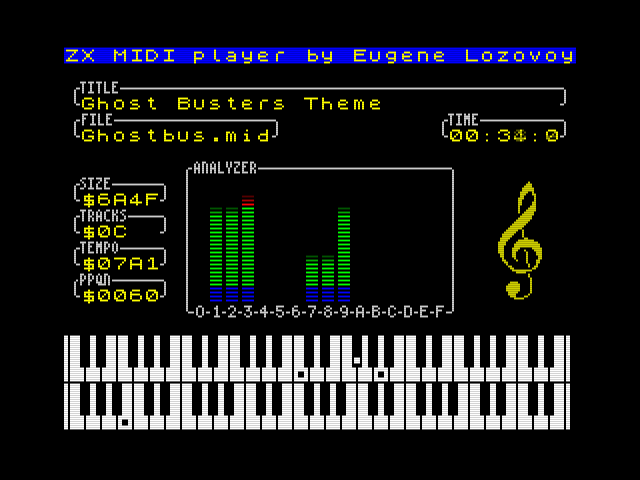

# WORK IN PROGRESS
MIDI Player for ZX Spectrum.

* Support for any ZX Spectrum-compatible computer with 128 RAM, e.g.:
    - ZX Spectrum 128/+2/+3 with [MAYK](https://github.com/konkotgit/MAYK) addon;
    - [Sizif-512](https://github.com/UzixLS/zx-sizif-512) with [extension board](https://github.com/UzixLS/zx-sizif-512-ext);
    - [ZX-Uno.1010](https://github.com/UzixLS/zxuno1010-board) or [ZX-Uno](https://zxuno.speccy.org/index_e.shtml) with MIDI addon;
    - [ZX Evolution](http://nedopc.com/zxevo/zxevo.php) with [Multisound](https://github.com/UzixLS/zx-multisound) addon.
* Support for MIDI type 0, type 1 and RMI file formats;
* Support files up to 64Kb;
* Support for up to 60 tracks in file (for heavier files, turbo CPU frequency is desirable);
* Support for various CPU frequencies - 3.5MHz, 3.54MHz, 7MHz, 14MHz, 28MHz (no-waitstates required for turbo modes);
* Support for BetaDisk/TR-DOS floppy interface (compatible with [ESXDOS](http://www.esxdos.org/index.html));
* External MIDI synthesizer required.

## MIDI synthesizer wiring
MIDI synthesizer data input should be connected to AY port A2.
This is standard MIDI wiring method defined by ZX Spectrum 128.

You may use addon with builtin MIDI synthesizer or connect an external one to your Spectrum - see [link](https://www.benophetinternet.nl/hobby/vanmezelf/ZX_Spectrum_Midi_Out.pdf) for howto.

## TODO
- Add scrollbars or entries counter to menus
- Handle last entry in playlist
- Implement FAT32 support
- Implement DivMMC, ZXMMC and Z-Controller support
- Correctly handle TRDOS-less environment
