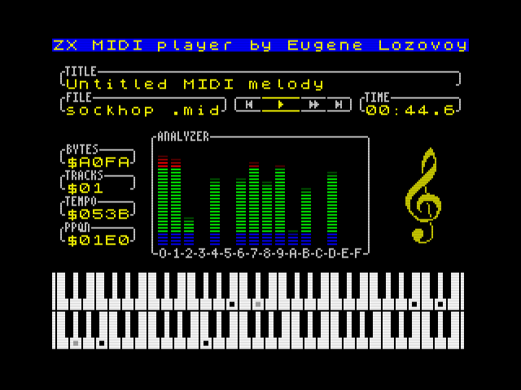

# ZX MIDI player
MIDI Player for ZX Spectrum.

Quick demo video: https://www.youtube.com/watch?v=X_hX_dGmGeg

* Support for any ZX Spectrum-compatible computer with 128Kb RAM;
* Support for MID(SMF) type 0, type 1 and RMI file formats;
* Support files up to 64Kb;
* Support for up to 60 tracks in file (for heavier files, turbo CPU frequency is desirable);
* Support for various CPU frequencies - 3.5MHz, 3.54MHz, 7MHz, 14MHz, 28MHz (no-waitstates required for turbo modes);
* Support for BetaDisk/TR-DOS floppy interface (compatible with [ESXDOS](http://www.esxdos.org/index.html));
* Support for SD card interfaces:
    - DivMMC (and derivatives);
    - ZXMMC;
    - Z-Controller;
    - NeoGS.
* Support for IDE disk interfaces:
    - DivIDE;
    - NemoIDE;
    - SMUC.
* Support for FAT32 filesystem;
* One of supported hardware MIDI synthesizers required:
    - Any 128K spectrum with external MIDI synth (see bellow);
    - [ZX-MultiSound](https://github.com/UzixLS/zx-multisound);
    - [NeoGS](http://www.nedopc.com/gs/ngs.php) revision CM with VS1053b chip;
    - [ShamaZX MIDI interface](https://www.youtube.com/watch?v=hMDe51TAx9s);
    - [MAYK](https://github.com/konkotgit/MAYK);
    - [Sizif-512](https://github.com/UzixLS/zx-sizif-512) [extension board](https://github.com/UzixLS/zx-sizif-512-ext);
    - [ZX-Uno.1010](https://github.com/UzixLS/zxuno1010-board) / [ZX-Uno](https://zxuno.speccy.org/index_e.shtml) MIDI addon.

## 128K MIDI synthesizer wiring
MIDI synthesizer data input should be connected to AY port A2.
This is standard MIDI wiring method defined by ZX Spectrum 128.

You may use addon with builtin MIDI synthesizer or connect an external one to your Spectrum - see [link](https://www.benophetinternet.nl/hobby/vanmezelf/ZX_Spectrum_Midi_Out.pdf) for howto.

Connecting via TurboSound is also supported. In this case you can connect data wire to either of two chips and select proper chip in player settings.

## TODO
- Support for >64Kb files
- Add scrollbars or entries counter to menus
- Restore previous menu position when going into parent directory ".."
